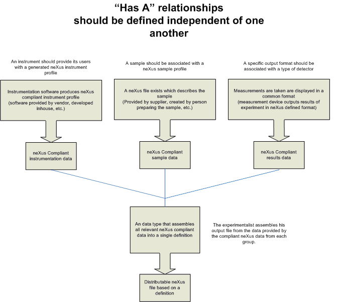
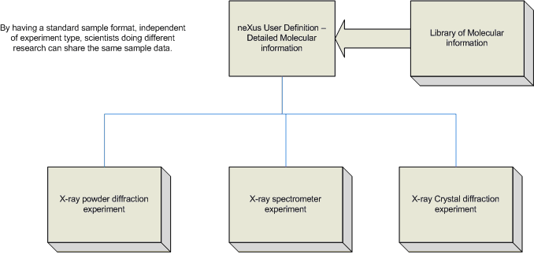

*Currently Under Construction - will be linked to the discussion page
when reviewed and completed*

This page presents how neXus could benefit from an
object/container-orientated approach to its user defined instrument
definitions. By allowing base user definitions for components, datasets
from from full datasets can be expressed as a sum of components.

The XSLT standard is a method that can possibly realize the extraction
of data from one or more XML based neXus definition and create a new
neXus XML document as desired.

Relationship between Inheritance and Containers in a neXus dataset
------------------------------------------------------------------

“Instrument” definitions can be assembled in a multitude of ways using
the neXus predefined classes. An instrument definitions are most often
is a superset of discrete components, with additional information which
that is general to all instrument definitions. The data contained in a
data set can be described via the “has a”/“is a” relationship
encountered in object orientated programming.

Traits that are inherent to all data sets in the neXus format can be
inherited from a parent class. This would be an “is a” relation, as the
data set “is a” set of neXus data, and has such properties.

A dataset is also a container, and thus contain small data subsets,
usually base neXus classes. This is a “has a” relationship, as a
container “has a” data subset.

------------------------------------------------------------------------

What is of interest in this discussion is the “has a” relationship. A
parent data set acts as a container for many simpler datasets. If these
“subsets” are specified independently, a greater deal of compatibility
and standardization can be achieved between software written by vendors,
scientists and engineers working on different aspects of a project.

user-defined component types can be shared amoung multiple experiment types
---------------------------------------------------------------------------

Independent component definitions allow vastly different experiments to
share common equipment or data, without having to redefine the data type
for each experiment. An equpiment or data library can have, in itself, a
standard format.

User-defined components can be inherited by more specific user components
-------------------------------------------------------------------------

Should additional data be needed for a more complicated equipment or
data library, it can inherent the previous definition, and add
additional information. This allows experiments that only require a
basic component definition to also use datasets that have additional
data appended.

--[Greg Sonnenfeld](User%3AGreg_Sonnenfeld "wikilink") 15:22, 27 January
2007 (UTC)
