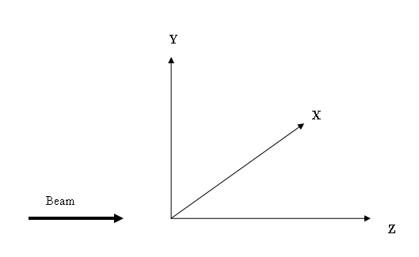

The MARS experience showed me that it is easy to get confused about the
NeXus coordinate systems. I therefore suggest the following:

-   Remove coordinates from all component DTD
-   Make a documentation page describing our two coordinate systems:
    -   The simple polare\_angle, distance etc system
    -   The NXgeometry system
-   State that coordinate describing datasets can occur in any component
    group
-   State that one system must be used throughout the whole definition

The last point should prohibit to have both NXgeometry and simple
coordinates in one DTD. This can be confusing. As NXgemoetry is anyway
intended to be used by the simulation community this should be OK.

NeXus Coordinate System
-----------------------

The NeXus coordinate system is based on the [McStas coordinate
system](http://mcstas.risoe.dk/). The instrument is given a global,
absolute coordinate system where the z axis points in the direction of
the incident beam, the x axis is perpendicular to the beam in the
horizontal plane pointing left as seen from the source, and the y axis
points upwards.

NXdetector defines a polar\_angle and an azimuthal\_angle. These
quantities correspond exactly to the usual [polar coordinate
definitions](http://en.wikipedia.org/wiki/Polar_coordinates) i.e. the
polar angle is measured with respect to the z axis and the azimuthal
angle to the x axis. The polar angle is often referred to as the *Bragg
angle* or *two theta*.
