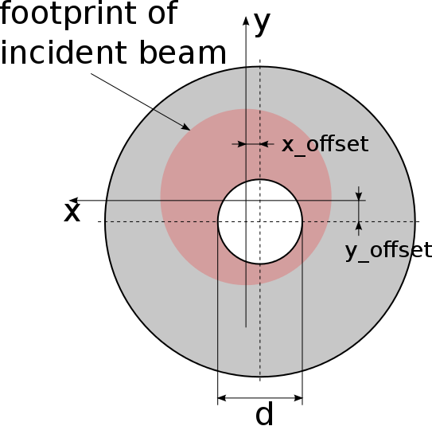

The actual *NXaperture* base class is far to complex for most of the
apertures used at synchrotron facilities. Currently the most commonly
used apperture types are

-   pinholes
-   2 or 4 blade slits.

From the current implementation of NXaperture it would be rather
difficult to obtain relevant quantities like the size of the slit gap or
the offsets of the gap. There are basically two ways how to face this
problem

-   redesign *NXaperture*
-   or introduce new classes for more specific aperture types.

Which of them is appropriate for us should be the topic of this
discussion.

Introducing new classes
-----------------------

#### Pinholes - *NXpinhole*

Pinholds are most probably the simplest apertures available. The only
parameter of importance is the diameter of the pinhole and its position
with respect to the beam (as shown in the image). From this sketch one
could easily deduce a new class *NXpinhole* with the following
parameters

    NXpinhole
      diameter:NX_FLOAT
      x_offset:NX_FLOAT
      y_offset:NX_FLOAT

#### Slits - *NXslit*
