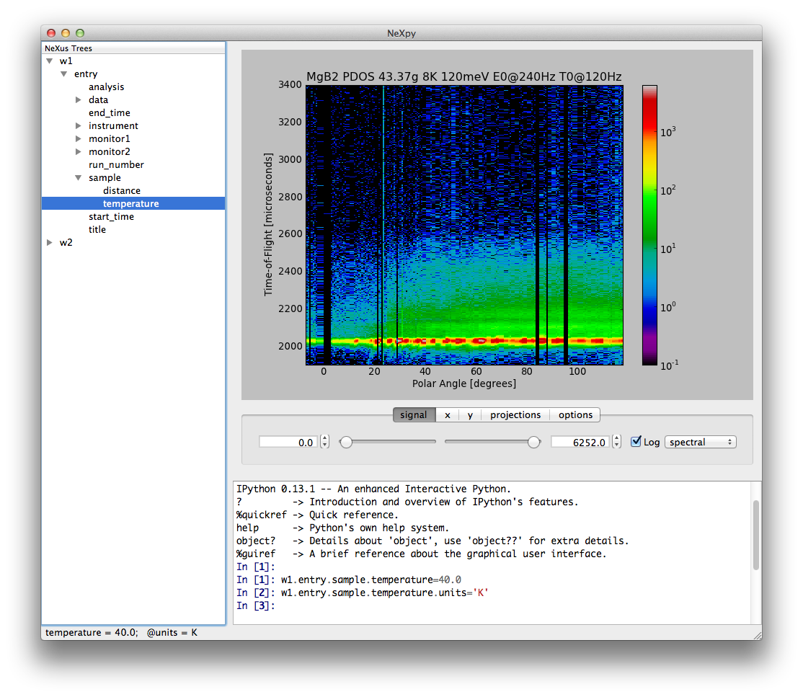

NeXpy provides a high-level python interface to NeXus data contained
within a simple GUI. It is designed to provide an intuitive interactive
toolbox allowing users both to access existing NeXus files and to create
new NeXus-conforming data structures without expert knowledge of the
file format.

Installation
------------

WARNING: NeXpy is in the early stages of development, and so there has
been no stable release yet. It is available for testing purposes only.

To check out the latest version from the
[Mercurial](http://mercurial.selenic.com/) repository and install the
NeXpy package to the standard python site-packages directory,:

`> hg clone `[`http://mercurial.mcs.anl.gov/repos/nexpy`](http://mercurial.mcs.anl.gov/repos/nexpy)  
`> cd nexpy`  
`> python setup.py install`  
` `

This assumes that the standard Python script directory is in your
default path.

The source code can also be viewed on the [NeXpy Trac
Server](http://trac.mcs.anl.gov/projects/nexpy/).

Running NeXpy
-------------

There are two ways of using the NeXpy interface to NeXus files.

1.  Within a standard python or ipython shell.

`# Using the GUI shell`

### Python Shell

`>nexpy rosborn$ python`  
`Python 2.5.4`  
`[GCC 4.0.1 (Apple Computer, Inc.)] on darwin`  
`Type `“`help`”`, `“`copyright`”`, `“`credits`”` or `“`license`”` for more information.`  
`>>> import nexus`  
`>>> a=nexus.load('data/chopper.nxs')`

### GUI Shell

To run the NeXpy GUI, type

`> nexpy`

 There are a
number of useful features available when running NeXpy within the GUI
shell.

1.  Data can be loaded with the <File:Open> menu item using a standard
    file browser window.
2.  All current NeXus data trees are easy to inspect in the pane on the
    upper left side. Hovering over a data item produces a tooltip
    containing a list of all the item's children.
3.  The root level of all newly created groups are automatically
    displayed in the tree.
4.  Any changes to data sets in the scripting window will be reflected
    within the tree pane, including the creation of new NXroot, NXentry,
    or NXdata groups.
5.  NXdata and NXmonitor plots can be displayed by right-clicking and
    choosing 'Plot'.
6.  Axis limits are set by a series of slider bars.
7.  The scripting shell provides convenient autocompletion, and
    automatically displays function docstrings as a tooltip when you
    open the function parentheses.

#### Planned Enhancements

-   Plotting projections along any axis by dragging and right-clicking
    the plots.
-   Editing data items in the tree within an editor pane.
-   Fitting data with predefined and user-supplied functions.

NeXus Interface
---------------

### Loading NeXus Data

The entire tree structure of a NeXus file can be loaded by a single
command.

`>>> import nexus`  
`>>> a=nexus.load('sns/data/ARCS_7326_tof.nxs')`

The assigned variable now contains the entire tree structure of the
file, which can be displayed with the nxtree() method.

`>>> a.nxtree()`  
`root:NXroot`  
` @HDF5_Version = 1.8.2`  
` @NeXus_version = 4.2.1`  
` @file_name = ARCS_7326_tof.nxs`  
` @file_time = 2010-05-05T01:59:25-05:00`  
` entry:NXentry`  
`   `[`data:NXdata`](data:NXdata)  
`     data = float32(631x461x4x825)`  
`       @axes = rotation_angle:tilt_angle:sample_angle:time_of_flight`  
`       @signal = 1`  
`     rotation_angle = float32(632)`  
`       @units = degree`  
`     sample_angle = [ 210.  215.  220.  225.  230.]`  
`       @units = degree`  
`     tilt_angle = float32(462)`  
`       @units = degree`  
`     time_of_flight = float32(826)`  
`       @units = microsecond`  
`   run_number = 7326`  
`   sample:NXsample`  
`     pulse_time = 2854.94747365`  
`       @units = microsecond`

Individual data items are immediately available from the command-line.

`>>> print a.entry.run_number`  
`7326`

Note that only the tree structure and smaller data sets are read into
memory to avoid using up memory unnecessarily. In the above example,
only the types and dimensions of the larger data sets are displayed in
the tree. However, the filename is also stored, so the data can be
loaded as soon as it is needed, either as a complete array or as a
series of slabs.

### Creating NeXus Data

It is just as easy to create new NeXus data sets from scratch using
Numpy arrays. The following example shows the creation of a simple
function, which is then saved to a file.

`>>> import numpy as np`  
`>>> x=y=np.linspace(0,2*np.pi,101)`  
`>>> X,Y=np.meshgrid(x,y)`  
`>>> z=np.sin(X)*np.sin(Y)`  
`>>> a=NXdata(z,[x,y])`  
`>>> a.nxsave('function.nxs')`

This file can then loaded into a second python variable.

`>>> b=nexus.load('function.nxs')`  
`>>> b.nxtree()`  
`root:NXroot`  
` @HDF5_Version = 1.8.2`  
` @NeXus_version = 4.2.1`  
` @file_name = function.nxs`  
` @file_time = 2010-05-10T17:01:13+01:00`  
` entry:NXentry`  
`   `[`data:NXdata`](data:NXdata)  
`     axis1 = float64(101)`  
`     axis2 = float64(101)`  
`     signal = float64(101x101)`  
`       @axes = axis1:axis2`  
`       @signal = 1`
